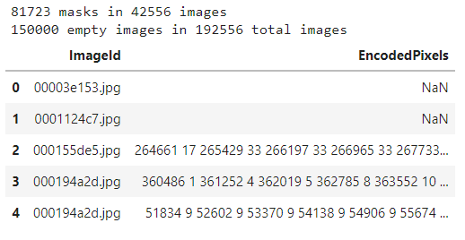
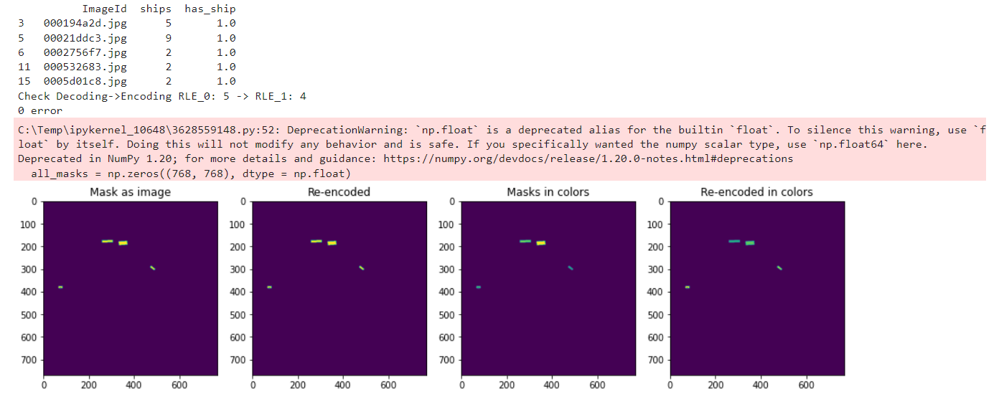
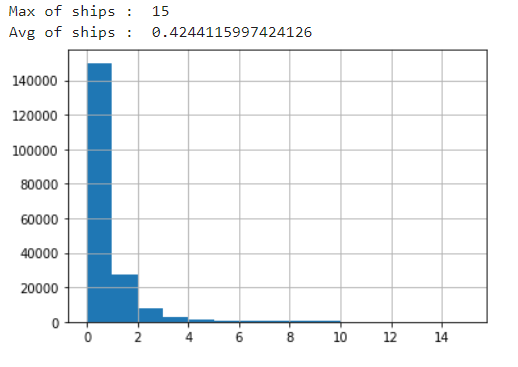
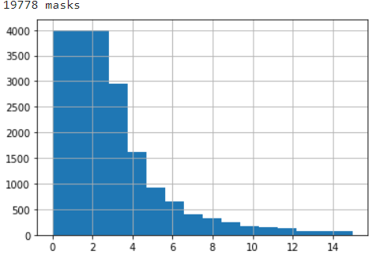
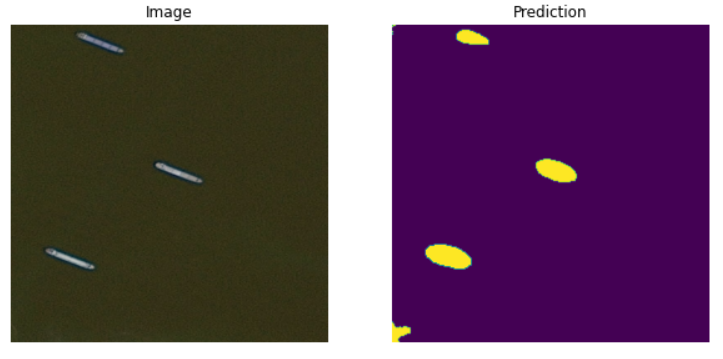
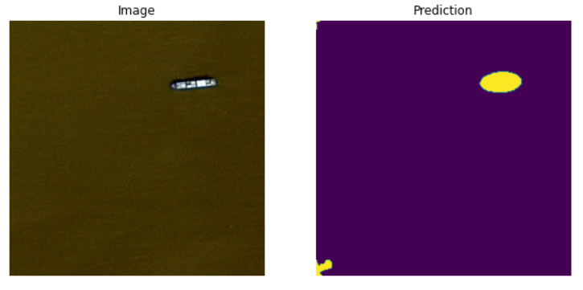
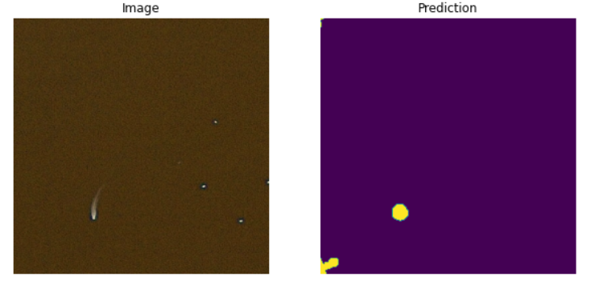
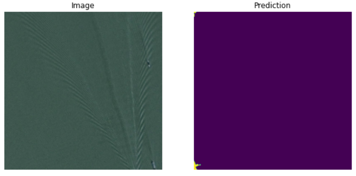

# Airbus-Ship-Detection-Challenge

Abstract: this repo includes a pipeline using tf.keras for training UNet for the problem of ships detection.
Moreover, weights and for the trained model are provided. **I will use notebooks/train.ipynb as main file in EDA below, all images from output train.ipynb.**

**Important:** balanced dataset (dataset created during analysis) includes 4000 images per each class (0-15 ships) because original dataset contains ~80% images with no ships. Also dataset was downscaled to 256x256, with original resolution the metrics might be better.

## Guide & EDA
### Guide

1. Important to notice that we have dataset in run-length encoding format, utils/utils.py contains encoders/decoders which were based on 
 **Link to Kaggle Notebook:** [tap here](https://www.kaggle.com/paulorzp/run-length-encode-and-decode).
 
   a. We need to create a base dir (in my case it's named 'airbus-ship-detection'). Then put there two subdirs 'train_v2' and 'test_v2'.
 
   b. Next download dataset from kaggle: [tap here](https://www.kaggle.com/competitions/airbus-ship-detection/data). And unzip it in that two subfolders according to their names.
 
   c. Now in base dir must be something like this:
 <pre>
 ├── train_v2
 ├── test_v2
 ├── train_ship_segmentations_v2.csv
 ├── sample_submission_v2.csv
 </pre>
 
2. I will use jupyter notebook because it's easy way to use your graphics card via Anaconda Navigator and also virtual environment is safer.

   Here is useful video how to use your graphics card via Anaconda : [tap here](https://www.youtube.com/watch?v=r31jnE7pR-g).

   **It's important to say that train.ipynb or test.ipynb are independed notebooks (need only datasets).**
   
   I will explain next steps for non jupyter users, for jupyter users this step is only to add files from dir 'notebooks'.

   New and **final directory tree** should be like this:
<pre>
 ├── train_v2
 ├── test_v2
 ├── train_ship_segmentations_v2.csv
 ├── sample_submission_v2.csv
 ├── utils
 │   ├── losses.py
 │   └── utils.py
     └── generators.py
 ├── config.py
 ├── train.py         #or train.ipynb
 ├── test.py          #or test.ipynb
 ├── fullres_model & weights
     ├── fullres_model.h5
     └── seg_model_weights.best.hdf5
</pre>
   ### Files description:
     a. utils/losses.py file contains all losses (also custom metrics) that be used for this task.
       I prefer dice_p_bce for this task according to the results, but you can try any other. 
  
     b. utils/utils.py is encoders and decoders, data visualization and masks as image file.
       We will use it just in the next few steps.
  
     c. generators.py contains batch generators for model and predictions, ready to be shown via matplotlib, for test.py file.
     
     d. config.py is small but influential file for this project. It allows to control batch size, data scaling, epoch or number optimizer-steps per epoch. 
     
     e. train.py here we will train our model. test.py for results visualization.
     
     f. fullres_model.h5 768x768 input/output pretrained Unet model. As i said above, dataset was downscaled.
     So, seg_model_weights.best.hdf5 contains only weights for Unet 256x256.
     
3. **Necessary pips** (notebooks already contain them).

```sh
!pip install --user numpy
!pip install pandas
!python -m pip install -U matplotlib
!python -m pip install -U scikit-image
!pip install -U scikit-learn
!pip install keras
!pip install tensorflow
```

Or you can also use requerements.txt.

### EDA

1. Imports:
```sh
import config
import numpy as np
import pandas as pd
import os
import matplotlib.pyplot as plt
from skimage.io import imread
from skimage.morphology import binary_opening, disk, label
from PIL import Image
from utils import multi_rle_encode, rle_encode, rle_decode, masks_as_image, masks_as_color, showImage
from sklearn.model_selection import train_test_split
from keras.preprocessing.image import ImageDataGenerator
from keras import models, layers
from generators import make_image_gen, create_aug_gen
from losses import dice_p_bce, dice_coef
from keras.callbacks import ModelCheckpoint, LearningRateScheduler, EarlyStopping, ReduceLROnPlateau
```

   Code above should show no problems, if it shows step back to the guide.

2. Now, let's check pathes:
```sh
BASE_DIR = 'airbus-ship-detection'
TRAIN_DIR = BASE_DIR + '/train_v2/'
TEST_DIR = BASE_DIR + '/test_v2/'
```

```sh
train = os.listdir(TRAIN_DIR)
test = os.listdir(TEST_DIR)

print(f"Train files: {len(train)}. ---> {train[:3]}")
print(f"Test files :  {len(test)}. ---> {test[:3]}")
```
  if everything is alright it shows:
```sh
Train files: 192556. ---> ['00003e153.jpg', '0001124c7.jpg', '000155de5.jpg']
Test files :  15606. ---> ['00002bd58.jpg', '00015efb6.jpg', '00023d5fc.jpg']
```

  So at this moment we are ready to deal with dataset.

3. train_ship_segmentations_v2.csv contains id and encoded pixels, some of them have no encoded pixels, it's mean that there is no ships on the picture.

     I will call this type of images 'empty'. Also on the same picture can be more than one ship, so we will use a masks as one image from utils.py.

     First let's create a database via pandas:
```sh
masks = pd.read_csv(os.path.join(BASE_DIR, 'train_ship_segmentations_v2.csv'))
not_empty = pd.notna(masks.EncodedPixels)
print(not_empty.sum(), 'masks in', masks[not_empty].ImageId.nunique(), 'images')
print((~not_empty).sum(), 'empty images in', masks.ImageId.nunique(), 'total images')
masks.head()
```
 

   150000 empty images in 192556 total images. Not really balanced dataset.

4. By reason of not balanced dataset, first of all, we need to create a new database with amount of ships for each picture and binary counter (column has_ship).
 


 let's also visualize to see if it's really unbalanced:
 ```sh
 unique_img_ids['ships'].hist(bins=unique_img_ids['ships'].max())
 print('Max of ships : ',unique_img_ids['ships'].max())
 print('Avg of ships : ',unique_img_ids['ships'].mean())
```
 
 
 5. To deal with, we will extract 4000 or less samples per each class (0-15 ships).
 ```sh
 SAMPLES_PER_GROUP = 4000
 balanced_train_df = unique_img_ids.groupby('ships').apply(lambda x: x.sample(SAMPLES_PER_GROUP) if len(x) > SAMPLES_PER_GROUP else x)
 balanced_train_df['ships'].hist(bins=balanced_train_df['ships'].max()+1)
 print(balanced_train_df.shape[0], 'masks')
 ```


6) At this moment we are ready to split our data for validation and train. You can check next steps in train.ipynb, there is no more EDA there.


## Architecture:

 - Architecture: UNet
 - Loss function: DiceBCELoss, IoU
 - Optimizer: Adam (lr=1e-3, decay=1e-6)
 - learning scheduler: ReduceLROnPlateau(factor=0.5, patience=3)
 
 ## General thoughts
 
 I've tried DiceBCELoss and DiceLoss, IoU as loss.
 The best results have been obtained with DiceBCELoss in this case.
 
 I need to add I've been bounded with Cuda memory capacity, so basicaly I could not try batch size > 10 with original resolution. So, i said above, it was downscaled.
 
fullres_model.h5 contains trained original model + upscaling to original.

## Results
| Architecture | binary_accuracy | Input & Mask Resolution | Epochs |
| ------ | ------ | ------ | ------ |
| Unet | 0.958 | (256x256)  | 8 |

Example 1:
 
 
Example 2: 
 
 
Example 3: 
 
 
Example 4: 
 
 
 ## Installation

```sh
!pip install --user numpy
!pip install pandas
!python -m pip install -U matplotlib
!python -m pip install -U scikit-image
!pip install -U scikit-learn
!pip install keras
!pip install tensorflow
```

Or you can also use requerements.txt.

